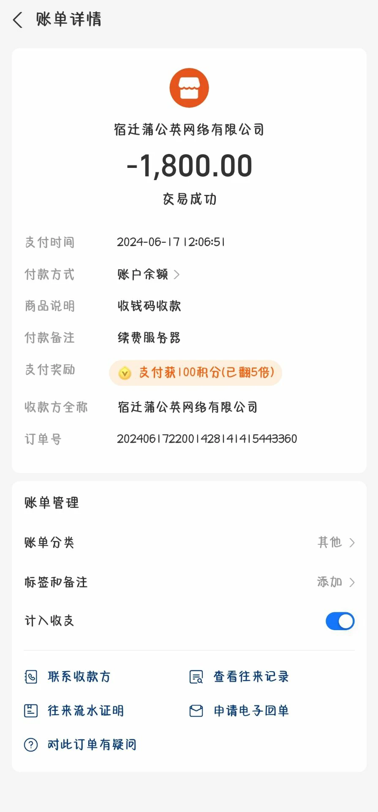
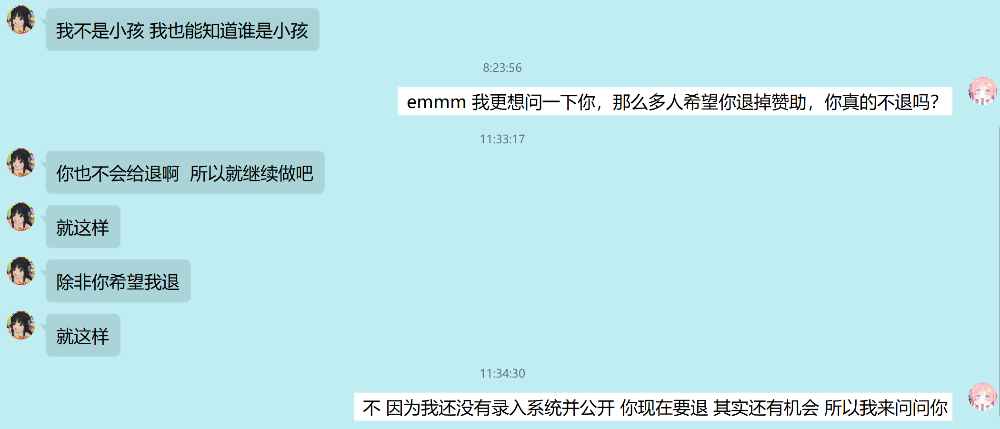
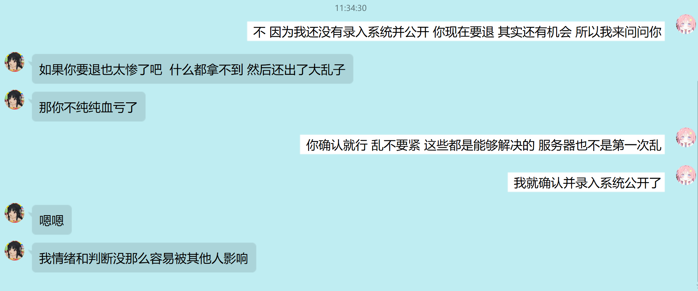
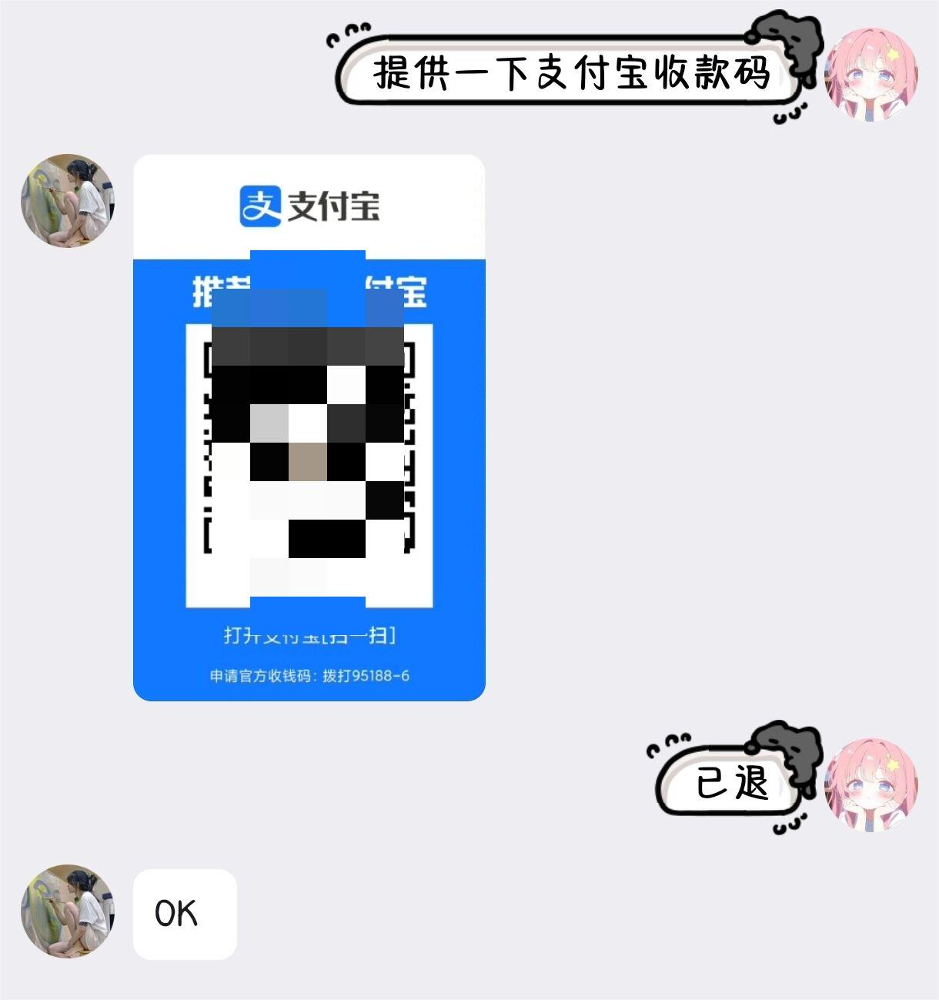

# 服务器收到了花花老板的2000元赞助

感谢花花老板赞助服务器**2000元**！

赞助费用已主要用于**续费服务器**。

::: danger 温馨提示
以后单次达到1000的赞助将直接用于续费服务器并且我不可能给你退回，你要退自己联系服务商退，他们愿意给你退我也没意见，赞助之前请**考虑自己的经济实力**
:::

## 赞助是你请我愿

另外赞助服务器是**你请我愿**的事情，你不愿意没人能从你口袋掏出钱来，某些**心智不成熟的未成年人**大可不必为别人操心

## 还是公益吗？

另外关于“公益”的事，我想服务器应该是时候去掉公益标签了，但是服务器有太多地方写着这两字了，如果你看到了，可以截图私信给我，会发一些纠正错别字的奖励。

我们和其它服（如tcc等）一样不再说自己是所谓“公益服”，我还是会**继续微笑着开我的小破服**。

## 开公益服“赚钱”？

开公益服一年，实不相瞒，我“赚了”5K左右，这是扣除了基本支出的利润，

但是，我并不觉得我赚了，如果网站我是请别人写的，插件也是请别人写的，这个利润会是负数，你应该明白，**什么是成本**，**看似赚钱实则亏钱**。

开公益服一年，我现在学会了微笑着开服，微笑着面对：你**公益服≠玩家领情**。

所以为了继续能**微笑开服**，别再搞什么公益了，我觉得很累不值得，为了更有动力开服和运营，真不搞公益了

没啥好喷的，我公益真开不下去抱歉

是不是公益你说了算，你觉得是就是，不是就不是，反正我先把标签拿掉以防止**心智不成熟的未成年人**来喷我

## 关于赞助的问题

如果你是学生，没有那么多钱，没有必要给服务器赞助，当然赞不赞助**看你心情**。

如果你是**心智尚未成熟的未成年人**，我也不建议你赞助。

总之，赞助之前**考虑清楚**，不要赞助了之后蹦出来跟我说啊我要退赞助，我一旦录入系统，就会变得很麻烦，如果尚未录入系统，你退也影响并不大。

当然我也肯定会因为你的**失信行为**封禁你，退多封久。

## 关于内群

我现在已经很**强调**了**很多次**，内群必定设置一个最低赞助门槛，赞助达不到那个数字（动态计算），确实进不了，

没啥好说的。就像我们服也是正版服，你不买正版MC？对不起，那你就是玩不了正版服。

没啥可说，进不了内群就大群待着热闹，买不起正版就去玩离线服。

你不要来跟我说，我没有正版能不能让服关闭正版验证，我没有赞助能不能把内群赞助门槛去掉让我进去，我只会觉得你是**来搞笑的小学生**
