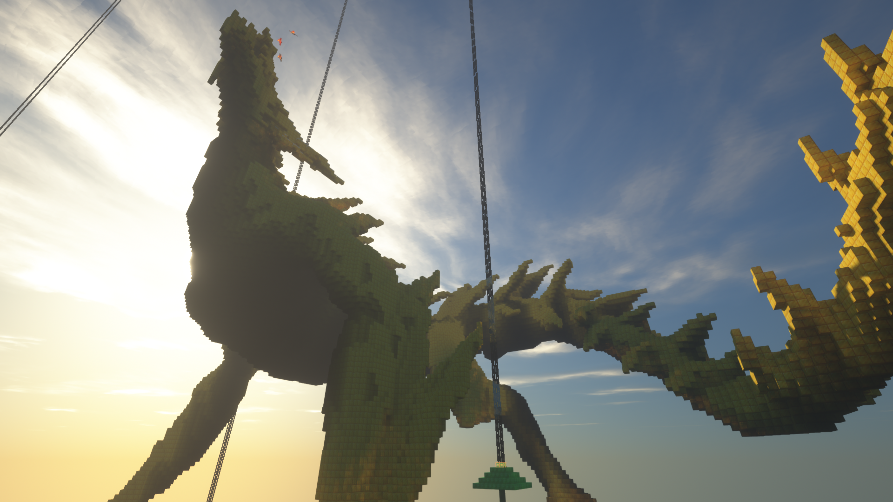
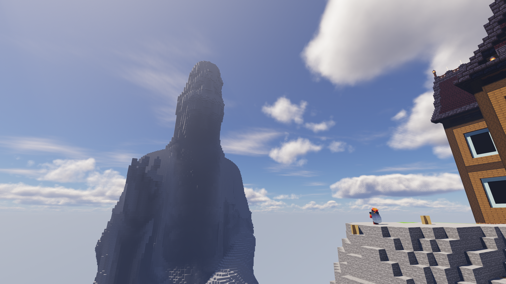

# 莱文市
>  **加入莱文市最好的时间是一年前**
>  **其次就是今天**

---

 

 ## 一、莱文市的开始
 1. #### 莱文市成立于2023年11月  
 - 起初为**市长镜**和**副市长枫叶**所创立的小团体。随着时间的推移，加之与*众多志同道合的爱好者共同交流*，社团逐渐壮大，成员人数增多。

 - 活动范围也从最初的建立一个伟大的城市扩展到了许多的创新项目，逐步成为了纸片服最具有代表性的社团。  
 2. #### 现如今莱文市历经第四周目和第五周目。  
 - 建筑艺术比拼，工业水平，后勤储备以及一些趣味小游戏，都已非常完善。

 - 基于**城建局**、**生电局**、**后勤部**、**施工队**四大部门，展开领域交叉合作，塑造给市民留下最美好的游戏体验，并以发展创新为核心，探索完美社团建设。

 - 同时，通过建筑、生电、小游戏等大大小小的有影响力的项目，**莱文市正致力于建设一个富有活力，具有无限想象力的完美社团**。

 ## 二、目前成果展示
 - 在过去的两个周目里，莱文市成员们集思广益，创造了许多极具美感的建筑作品和效率爆炸的生电作品。其中许多建筑的都被广泛的应用在宣传视频当中。

 - 社团成员不仅通过游戏学习了建筑知识、历史文化、生电编程，更通过参与项目提升了团队合作与项目管理能力。

 ## 三、莱文市小知识
 - ``/spawn 莱文市 ``或者``/spawn 莱文市黎明区``均为莱文市传送点
 - 在两个传送点附近未开发位置均可建家或建造建筑
 - 莱文市的公共机器坐标表均在莱文市群的群公告当中
 - 如果对*开荒体验*很看重的话可以先*独自*开荒一段时间再使用社团机器
 - 禁止在主人**未允许的情况**下**使用他人机器**，**拿取他人物资**，**破坏建筑**等
 - 有任何问题均可在**莱文市群中**提出

 ## 四、面对未来的规划

> [!WARNING] 莱文市计划进一步扩大其影响力。  
> 一方面将继续提出更**新颖的设施计划**,与其他社团共同探索游戏与建筑的新颖想法；另一方面，社团还将研究更多**生电设施**，为**莱文市**~~统治纸片服~~**屹立于纸片服**长久不衰而不断探索与实践.

> [!TIP]同时  
> 莱文市也致力于研发各种新型小游戏和更多的新颖项目，尽可能让每一位成员既能***玩的开心***，***又能展示自我***、***发挥特长***。

## 五、加入莱文市审核群

> #### ***在莱文市中，世界就在你脚下***   
> #### ***无需踌躇，无需回首，无需唏嘘，目之所至，皆为前路***  
> #### ***用你们的创造走向加入更大的平台，加入我们，用方块堆砌更多可能***
