# 称号指南（Minedown代码指南）

- 在第一次加入到服务器器时会获得『萌新』称号，一周后消失~
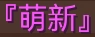
- 游戏内达成全成就（含隐藏）会自动获得『登峰造极』称号！
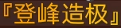
- 服务器有属于妹子的专属称号，可私信腐竹添加这个称号~
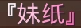

## 【自定义称号-永久版】

**价格（对于正常长度的称号）：**
- 单色称号：50元（按月是10元/月）
- 渐变称号：150元（按月一般是39元/月）  推荐选择相近的两个颜色，由浅入深或由深入浅
- 彩虹称号（多种颜色）：150元，与渐变称号价格相同
> [!warning]长度限制
> 如果超过了6个汉字长度（1个汉字长度约等于2个英文字母长度），每超出一个字，+50电池/月

## 如何设计

1. 首先你需要确定你想要的效果（样式）
2. 然后点此处挑选你想要的颜色→[**16进制颜色代码大全**](./color.md)

### 样式参考

**可使用`/minedwon <代码>`预览MineDown代码的显示效果**

> [!tip]提示
> Minedown代码也可用于铁砧命名物品哦

- **单色称号（使用颜色名）**：`/minedown &gold&『这是一个称号』` 

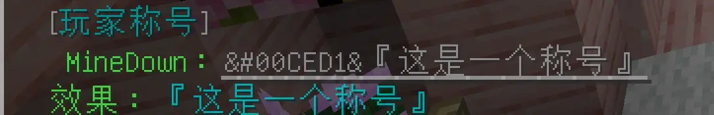

- **单色称号（使用十六进制颜色代码）**：`/minedown &#00CED1&『这是一个称号』` 

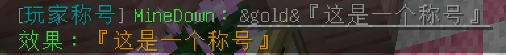

- **单色加粗**：`/minedown &gold&&l『这是一个称号』` 

- **单色斜体**：`/minedown &gold&&o『这是一个称号』` 

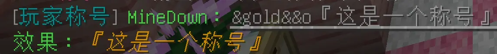

- **单色删除线**：`/minedown &gold&&m『这是一个称号』` 

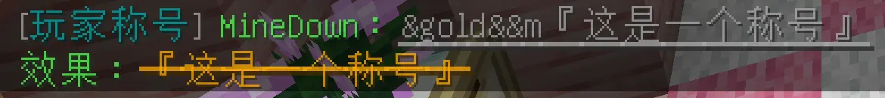

- **单色下划线**：`/minedown &gold&&n『这是一个称号』` 

- **单色加粗斜体**：`/minedown &gold&&l&o『这是一个称号』` 

- **彩虹**：`/minedown &rainbow&『这是一个称号』` 

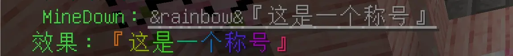

- **彩虹（带相位）**：`/minedown &rainbow:20&『这是一个称号』` 

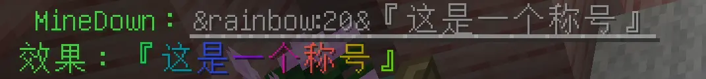

- **彩虹（带相位）**：`/minedown &rainbow:40&『这是一个称号』` 

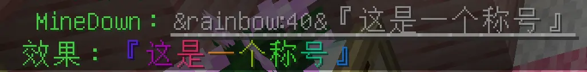

- **彩虹加粗**：`/minedown &rainbow&&l『这是一个称号』` 

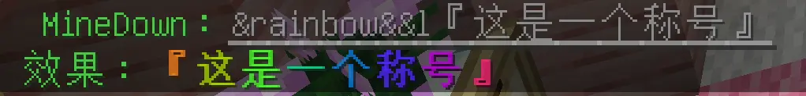

- **渐变**：`/minedown &#BBFFFF-#1E90FF&『这是一个称号』` 

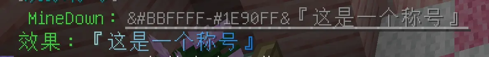

- **渐变加粗**：`/minedown &#BBFFFF-#1E90FF&&l『这是一个称号』`

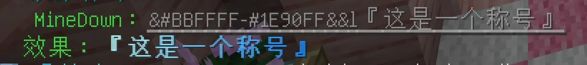

- ***特殊效果代码***

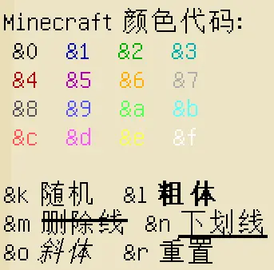

## 如何获取

给腐竹发一下QQ私信：  
模板：  
你好，弄个XX永久称号  
<提供赞助的截图>  
内容：XXXX  
颜色：XXXX

> [!tip]
> 多称号查看及切换可使用`/pt list`查看自己的称号列表