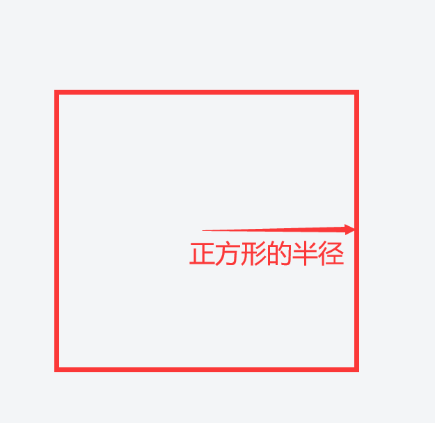

# PaperCard区块保留完全教程

## 背景

1. 由于PaperCard服务器的存档非常大（大约几十个GB），将存档全部备份会占用大量磁盘空间，并且一次备份也消耗较多时间，限制了备份的频率不能过于频繁。同时，由于备份过大，也不利于网络传输进行异地份。  

2. 为了最大限度保证游戏存档的安全性，同时避免上述问题，我们采用了自研的**轻量级备份技术**。  

3. 由于一个存档中，并不是所有的区块都是要进行备份的，大多数情况下，只有包含玩家建筑的区块才需要进行备份和保留。这是**核心理念**。  

4. 分析Minecraft的存档文件结构，一个区块的数据并不是单独存储在一个文件中，而是多（32x32）个区块存储在同一个文件中。这个文件正是区域文件。一个区域（region）由32x32个区块（chunk）组成。正是这样的存储结构，为我们的轻量级备份技术提供了**可行性**。  

5. 哪些区块需要被保留，哪些区块不需要被保留，也是一个需要解决的重要问题。我们的做法是，让玩家来决定一个区块是否应该被保留。玩家通过一系列指令提出保留申请，待管理员审核通过后，这些区块就会被保留。

## 基本概念

- **区块**：一个区块的大小是16x16，在游戏中可以通过快捷键F3+G来切换区块边界显示的开与关。关于区块的详细描述可查看Wiki：  
https://minecraft.fandom.com/zh/wiki/%E5%8C%BA%E5%9D%97

- **保留区块**与**非保留区块**：一个区块，要么是被保留的，要么是不被保留的，没有其它状态。

- **保留区域**：一个保留区域是由一片保留区块组成的，它通常会有一个名字，这个名字由玩家来决定。一个保留区域有且只有一个所有者，是创建它的玩家。

## 玩家教程

### 指令总览：  
`/cr pos1` 选择点1

`/cr pos2` 选择点2

`/cr check` 检查你所在的区块属于哪个保留区域

`/cr create <保留区域名称>` 创建新的保留区域。需要先选择一片区块。  
- 名称要求：由中文、大小写字母、数字组成，有字数限制，~~但我忘了~~。  
-  示例：`/cr create 基地`

`/cr remove <自己的保留区域名称>` 删除自己的保留
- 示例：/cr remove 基地

`/cr list [页码]` 查看自己的保留区域列表  
示例1：`/cr list` 查看第一页  
示例2：`/cr list 2` 查看第二页

`/cr detail <保留区域ID>` 查询保留区域的详细信息，查别人的也是可以的，知道ID就行

### 选择要保留的区块范围：  

> 这个范围是一片区块，这一片区块会组成一个矩形。（这就像屏幕截图时选择截图区域时一样简单）  

1. 到一个建筑的一角（推荐西北角）执行命令：/cr pos1  

2. 到建筑的斜对角执行命令：/cr pos2  

3. 然后就完成了选择。

### 创建保留区域保留区域：  
`/cr create <保留区域名称>`  
- 如：/cr create 基地

## 管理员指令
`/cr application` 查看第一条没有审核的申请  

`/cr accept <保留区域ID>` 同意保留区域申请  

`/cr remove-by-id <保留区域ID>` 根据ID删除保留区域  

### 申请状态：  
- Pending: **等待审核**

- Acceped: **已经同意**   

- Rejected: **已经拒绝**

## 关于地图重置的常见疑问

### Q: 地图重置与玩家的保留区块有什么关系？

A: 地图重置时，玩家的保留区块永远不会被重置。其他区域可能重置，也可能不重置，这取决于重置的类型。  

### Q: 轻量级备份与玩家的保留区块有什么关系？  

A: 轻量级备份只备份玩家的保留区块和服务器的保留区块，其他的区块一律不备份。服务器会比较频繁的进行轻量级备份，以保证游戏存档的安全性。  

### Q: 像1024范围、4096范围这些词语的意思是什么？  

A: 1024范围是：以坐标 (0,0) 为中心、1024（格）为半径的正方形区域。正方形的半径是它边长的一半。其它数值的范围以此类推。

### Q: 地图重置有哪些类型？

A:   
1. 末地外岛重置：保留末地主岛（坐标绝对值小于1024的范围内），重置末地外岛，玩家在末地外岛的保留区块，不会被重置。每次重置末地都换新的种子。

2. 主世界一般重置：主世界4096范围内保留，以外的区域，除了玩家的保留区块，全部重置。

3. 下界一般重置：下界512范围内保留，以外的区域，除了玩家的保留区块，全部重置。

4. 最大化重置：除了玩家或服务器的保留区域，其他一律进行重置，不管哪个世界。最大化重置是用最近一次的轻量级备份存档覆盖原有存档（先删除原有存档）。

### Q: 服务器的保留区域范围？  

A: 任何世界的512范围内都是服务器的保留区域。  

### Q: 何时会发生最大化重置？  
A: 

1. 当因为某些原因（硬盘损坏等等）导致存档损坏或丢失时

2. 当需要迁移存档到新机器上时

3. 当升级MC版本时，需要最大化重置来让新版本的地形生成器来生成新地形。

4. 当安装新的地形插件或数据包时，也需要最大化重置来生成新的地形。
