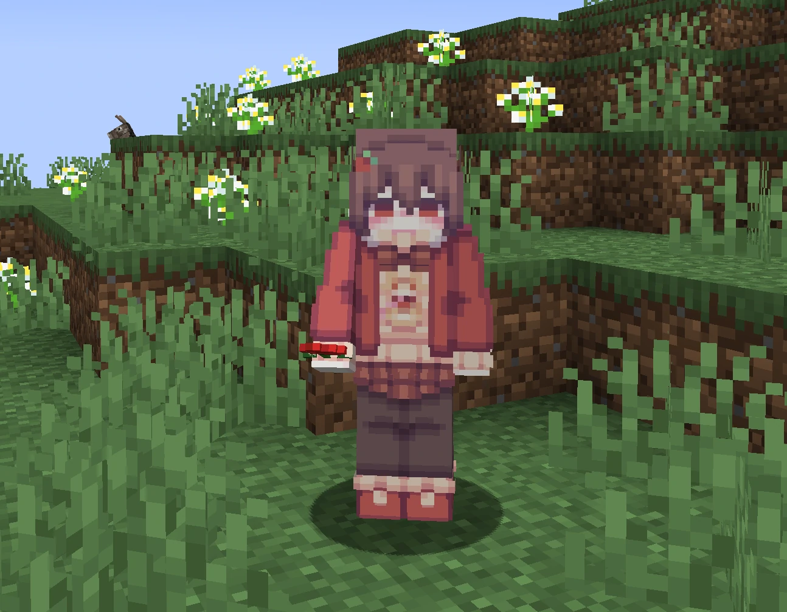
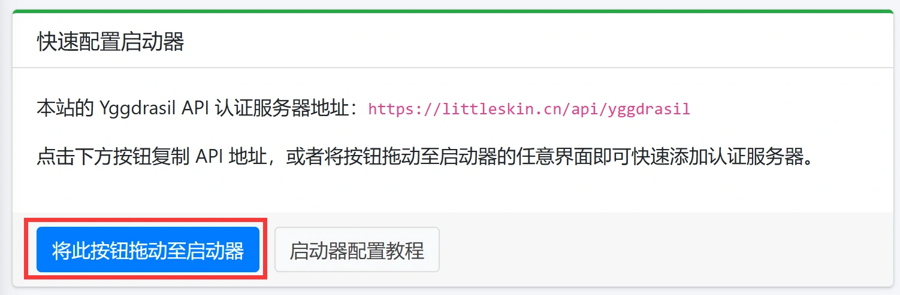
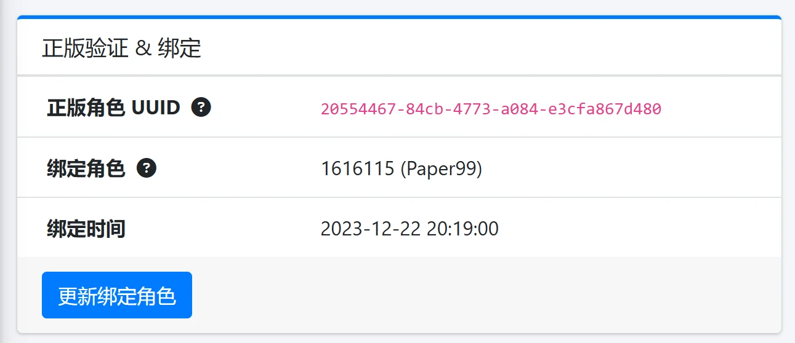
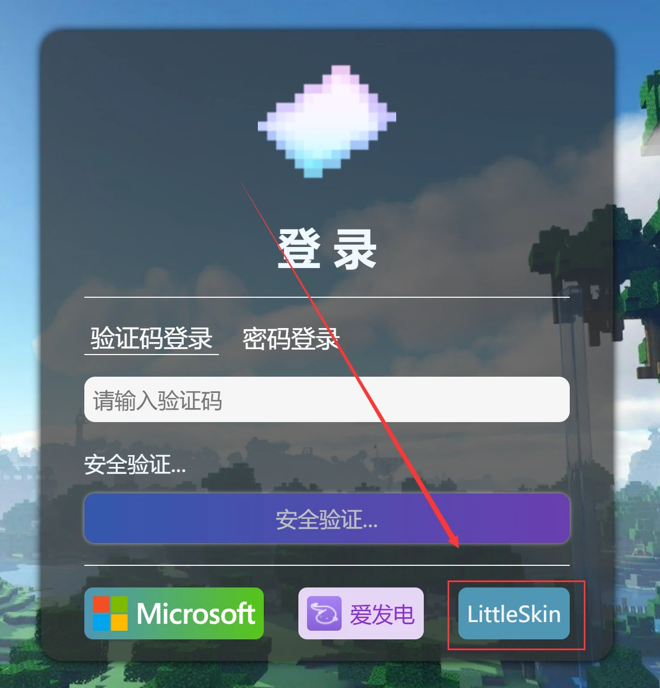
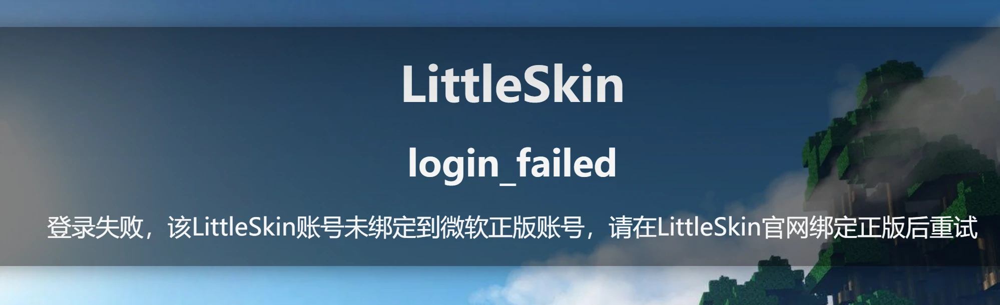
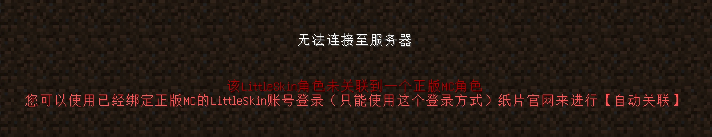

# LittleSkin登录

服务器支持使用[LittleSkin](https://littleskin.cn/)登录

## 优势

1. **快速且稳定**：LittleSkin服务器位于国内，相比正版验证的微软服务器，延迟更低，速度更快。LittleSkin运营多年，服务器稳定可靠，很少出问题

2. **高清皮肤支持**：使用LittleSkin登录，可以在服务器中使用高清皮肤和披风！当然，这需要[CustomSkinLoader](https://manual.littlesk.in/newbee/csl#customskinloader)模组支持，原版MC仅支持64x64的皮肤。

## 使用方法

1. 根据LittleSkin的教程配置启动器并进行登录：[点我查看](https://manual.littlesk.in/yggdrasil/client)

2. 确保你的LittleSkin账号已经绑定了正版MC：

3. 使用LittleSkin登录方式登录[纸片官网](https://paper-card.cn/)完成角色导入：

4. 现在使用LittleSkin登录进服玩了！

## 常见问题

1. 无法使用LittleSkin账号登录纸片官网？

   确保你绑定了正版MC账号，如果没有绑定，提示会是这样的：

   
   
2. LittleSkin登录无法登录服务器？

   一般情况是你没有使用LittleSkin登录纸片官网进行角色导入：

   

   你只需要使用LittleSkin登录纸片官网，完成角色导入即可。

3. LittleSkin可以创建很多角色，是不是可以开很多小号了？

   并不行，你以任何角色登录，都会登录到你绑定的正版MC账号上去，不会是以另外一个新玩家的身份登录进服。
