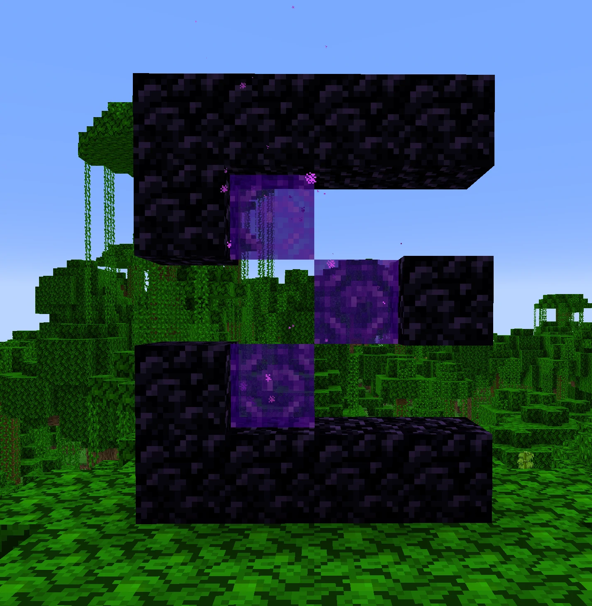

# 2024年5月31日更新

新增了机制：**PaperBreak**

## 什么是PaperBreak

PaperBreak为Paper99开发新增的游戏特性，允许玩家在**生存模式**下比较方便地破坏一些不能直接破坏的方块，如基岩

~~PaperBreak是一种神奇的**魔法**，它将借助**Paper之神**的神秘力量，破除一切坚硬方块，你需要在公屏大喊“**古娜拉Paper之神**”来使用该魔法，这是召唤**咒语**~~

## 使用方法

在要破坏的方块的一侧放置**黑曜石**，然后在**潜行状态**下用稿子**挖掉黑曜石**，即可破坏该方块

## 注意事项

1. 该特性仅在**生存模式**下使用

2. 可破坏的方块类型：**基岩**、**屏障**、**光源方块**、**下届传送门**、**末地传送门框架**、**黑曜石**

3. **不掉落**原物品，像拆掉玻璃一样

4. 如果黑曜石附近有**多个紧邻方块**，则只破除一个，并且6个面的优先级不同：顶>底>东>南>西>北

5. 破坏方块**不触发方块更新**、可用于**切门**

6. 刚进服不可使用该特性，需要在当前周目服**游玩满7天**才可以使用该特性

7. 如果希望**提前获得**，可以在电池商店（`/coins buy` 指令）购买该权限

8. 使用该特性破坏的方块、`CoreProtect`会记录

