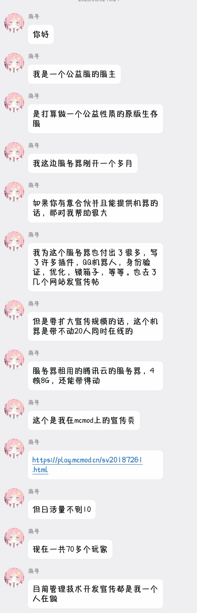

# 我将继续前行

## 自私

最近服务器事情还挺多。

把那些曾经那么那么支持我，信任我的人劝退后，我发现我并没有那么开心。

虽然服务器里确实有部分玩家让我极度讨厌，但我不应该以偏概全。

我不知道，原来还有那么多人支持我，但是我却没有看到他们。

他们有的帮我处理服务器的管理事务；

有的努力帮我宣传招新；

有的主动为萌新提供帮助、解答他们的疑问；

有的编写服务器的文档；

有的给服务器提出宝贵的意见；

有的策划活动；

还有许多许多热爱这个服务器、并赞助了许多的玩家。

我真是太自私了，我只看到了自己的付出，却忘记了，还有这么多人为这个服务器付出了时间精力。

## 初心

我曾经说，想做一个国内优秀的的正版生存服，让许多MC玩家都知道纸片服的存在。

我不禁反思，现在的服务器，是我想要的服务器吗？

我让这么多热爱这个服务器的玩家带着失望离开。

我一遍遍安慰自己说，一批老玩家走一批新玩家来，很正常，原版生存就这样，他们一会玩腻就退了。

我现在身陷抑郁的泥潭，我到底是为了什么而开服呢，我想不明白。

## 自责
作为一个腐竹我真的做错了，一个服务器，最重要的是玩家啊。

而我却忽略了这个最重要的东西。

他们这么热爱，我给他们带来的确实失望离开。

我开始自责，要是我没有去做那些决定该多好啊，一切都将还是原来的那样子。

我忘记了，他们是如何支持我的，我却又想起来了。

我告诫自己，他们只是一群玩服务器的玩家罢了，但是不知道为什么，我真的会舍不得，甚至会心碎，我把他们都推开了。

我回忆起曾经和他们玩耍，那时候是那么开心。

我不知道自己在什么，有时我也无法理解自己，你开心了吗？

很抱歉，我无法让所有玩家都满意，也很抱歉让这么多支持我的人选择离开。

如果再来一次，我将不会做出那样的决定。

## 我将继续前行

这些时间，我进行了自我反思，我做的决定，未必都是对的，

因为我也只是一个普通人，无法做到十全十美，更应该多听取他人的意见，而不是固执己见。

给他们带去的，应该是希望，而不是失望。

我收拾情绪，将继续前行，小破服虽然还是并不美好，但也将继续前行。

## 他们还会回来吗？

我不知道，也并不敢去期待，但服务器将不会拒绝任何想玩的玩家。