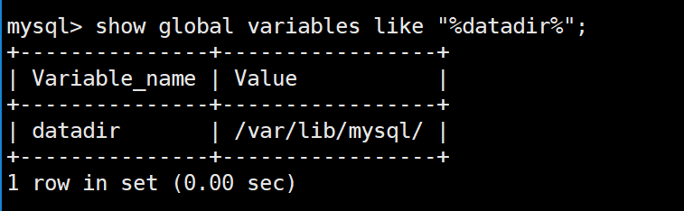
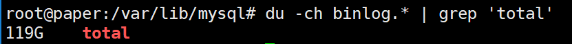
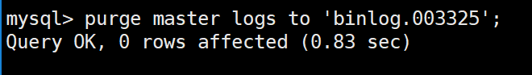

# 删除MySQL的binlog，释放磁盘空间

日期：2024年6月1日

## 查看存储根目录

使用MySQL命令：`show global variables like "%datadir%";`

## 查看占用的存储空间

使用Linux命令：`du -ch binlog.* | grep 'total'`

## 查看正在使用的binlog

使用MySQL命令：`show master status;`

## 删除所有binlog

使用MySQL命令：`purge master logs to 'binlog.003325';`

> [!DANGER] 注意
> 这里的`binlog.003325`是上一步图片中`File`字段对应的值，需要根据实际情况进行修改

查看删除后的磁盘占用:

