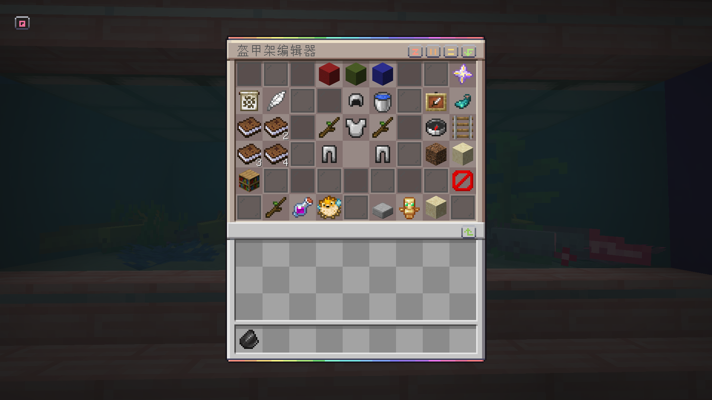
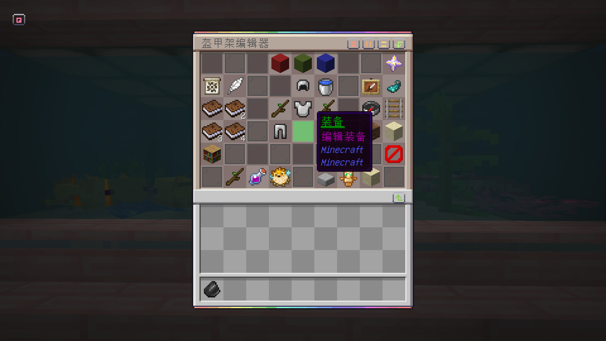
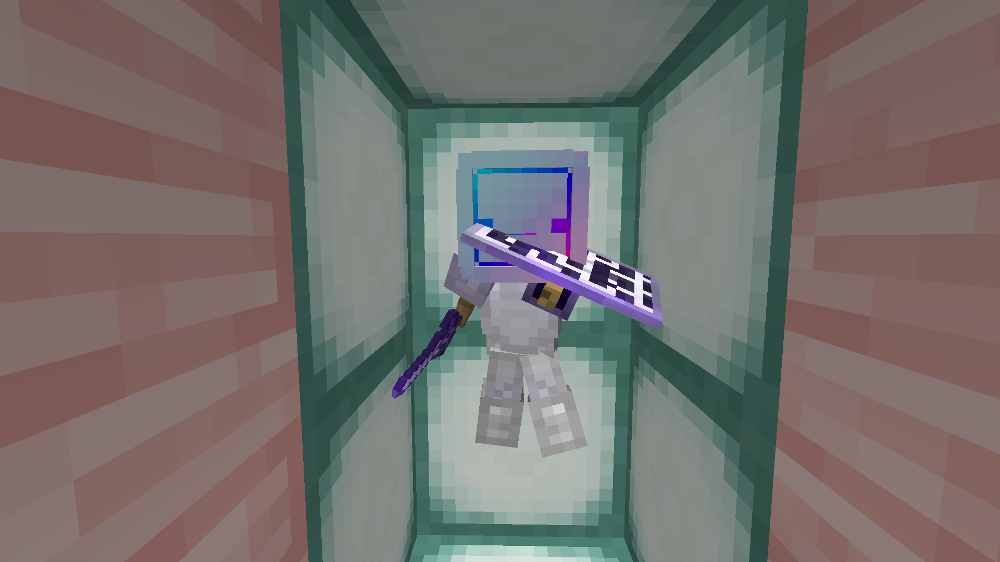

# 盔甲架编辑

## 如何使用

1. 把**编辑工具**握在主手里(默认是燧石)

2. **左/右键点击**(非装甲架)打开菜单

3. 选择**已标记的**菜单选项

4. **左/右点击盔甲站与工具在手应用这些选项**

### 提示

- Shift+ 滚轮向上/向下快速改变轴

- 记住，当旋转身体部位时，左键旋转一个方向，右键单击盔甲架旋转相反的方向。

- 粗调节可快速旋转身体部位，而细调节可让您在接近时微调位置。

- 当你复制装甲架设置时，工具会自动切换到粘贴模式

- 其他装甲站会妨碍你吗?按切换项目键(默认为F)来瞄准特定的装甲架。
