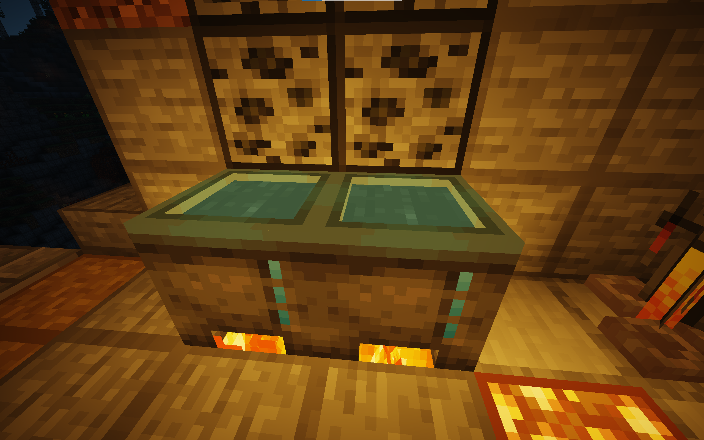
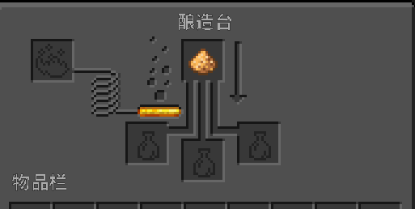
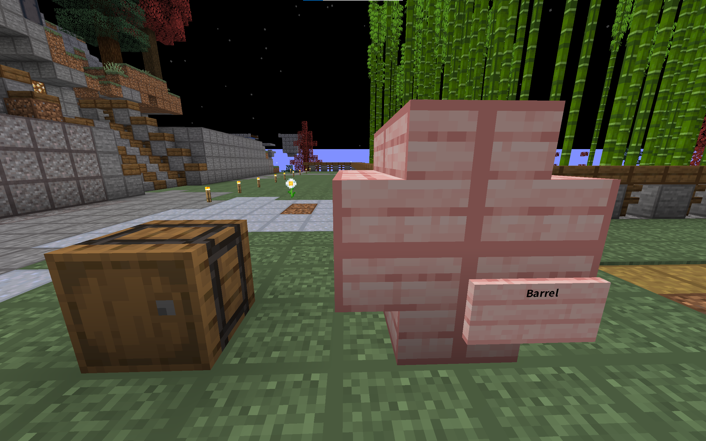
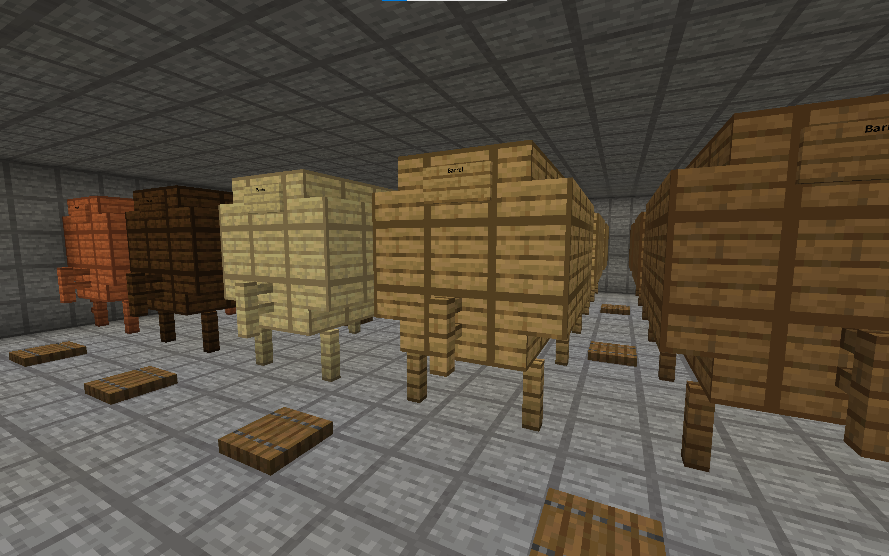
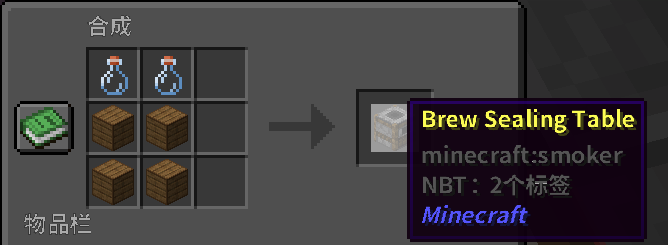

# 酿酒教程
***温两碗酒，要一碟茴香豆。***
## 发酵 
发酵新鲜的食材
 1. 将**炼药锅**放在火源或其他热源上，装满水 
 2. 右键**单击**添加原料
 3. 等待原料发酵几分钟，时间到后用玻璃瓶装起来

*小提示：如果你想知道发酵的时间，请手持“**时钟**”右键大锅查看* 
## 蒸馏
有一些酒制作时不需要蒸馏步骤
 1. 将带有发酵物的玻璃瓶放入酿造台中
 2. 将**萤石粉**作为催化剂放到最上面（蒸馏时不会消耗萤石粉）

## 陈酿
陈酿化酒需要一个桶，可以很小，也可以很大！

#### 迷你桶（木桶）和小桶
使用 8 个木制楼梯来构建小桶形形状。
在右下角放置一个标牌，并在上面的行中写上 “Barrel”

*小提示：创造成功后会提示“木桶已创造”，大桶同理*
#### 大桶
使用 5 个栅栏，16 个木制楼梯和 18 个木板来构建桶形形状，别忘了在桶前面装好水龙头（栅栏）和一个写有“Barrel”的告示牌。

 - 右击打开桶，将酒放入桶中静置。
 - 把饮品放进桶里就能贮存。
 - 每经过一个 **MC日**，饮品就会贮存**一年**。
 - 根据配方的不同，用于建造桶的木材类型可能会改变陈酿的质量。
 - 原版桶**始终判定**为橡木桶。

桶不应该在静置时被破坏，因为这会泄漏里面的美酒 :(！！由于服务器不知名原因，请在服务器每次重启时拿出你的酒，不然会导致消失！！
> 干杯！！！🍻 经过了重重工序，你终于能喝上美酒啦。酒内的酒精会在饮用时被激发，根据它的含量，这将有不同的效果。畅饮后希望你还能找到回家的路
## 密封
你可以把你酿造的饮品提供给其他玩家，他们可以放进桶里继续贮存。但玩家商店要求出售的物品必须完全相同，由此需要用打包密封的方式来解决。想象一下，就和用封条把酒封起来一样。
  - 要出售饮品，你需要在密封桌上进行密封
  - 密封桌需要 2 个瓶子和 4 个木板
  - 把饮品放入，就能使它们的属性均等
  - 密封的饮品不能继续贮存或进一步加工，也不能显示详细信息

## 附录：配方
服务器配方有所不同，以下是来自服务器玩家的摸索所得出的配方
| 配方       | 原料                     | 发酵时间 | 蒸馏 | 陈置/木种    |
| :--------- | :----------------------- | ------- | ---- | ---------- |
| 啤酒       | 6 小麦                   | 8 分钟   | ×    | 3 年/任何   |
| 麦酒       | 3 小麦                   | 8 分钟   | ×    | 2 年/白桦   |
| 黑啤       | 6 小麦                   | 8 分钟   | ×    | 9年/黑橡木 |
| 红酒       | 5 甜浆果                 | 5 分钟   | ×    | 19年/任何   |
| 蜂蜜酒     | 6 甘蔗                   | 3 分钟   | ×    | 4 年/橡木   |
| 苹果蜂蜜酒 | 6 甘蔗、1 苹果           | 和蜜酒相似 | ×   | 4 年/橡木   |
| 威士忌     | 10小麦                     | 10分钟 | √ | 20年/云杉 |
| 朗姆酒     | 18甘蔗                 | 6分钟       | √    | 11年/橡木    |
| 伏特加     | 10 土豆                  | 15分钟       | √    | 无需        |
| 龙舌兰     | 8仙人掌               | 15分钟       | √    | 12年/桦木    |
| 苦艾酒     | 15草                   | 3分钟       | √    | 无需        |
| 土豆汤     | 5 土豆、一些草           | 短       | ×    | 无需        |
| 咖啡       | 12可可豆、2 桶牛奶    | 2分钟       | ×    | 无需        |
| 米酒       | 7小麦种子                   | 8分钟       | x    | 15年/橡木桶 |