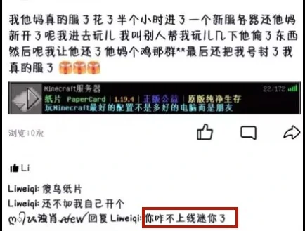

# 玩家守则

这是PaperCard玩家守则，任何玩家游玩之前都必须同意该守则。

我们将在您第一次进服之前提示您查看并同意该守则。

您进服游玩意味着您同意遵守该守则。

## 四大基本条例

1. **恶意破坏**他人建筑的行为，由建筑者决定处罚方式，最高永久黑名单、跨服联合封禁

2. 未经他人同意取用他人物品、使用他人机器的行为（**偷窃**），由资源所有者决定处罚方式，最高临时封禁6个月。
[点击查看：“偷东西”指南](./steal)

3. 使用**外挂**或不被允许的辅助功能的行为，最高永久黑名单和跨服联合封禁。
[点击查看：可用与不可用模组列表](./mods)&nbsp;&nbsp;&nbsp;&nbsp;[点击查看：“开挂”指南](./cheat)

4. 其它**未定义**的、引起其它玩家不满的行为，已在**补充条例**列出。未列出的由其它玩家和管理员讨论决定处罚方式，最高永久黑名单、跨服联合封禁

> [!IMPORTANT] 重要提示
> 你可以参考别人怎么被封的，就知道哪些是违规行为了，但不要模仿，[点击查看：所有封禁记录](https://paper-card.cn/ban)

## 补充条例

1. 不是自己的东西，千万不要拿，装有CO插件，任何玩家都可以查询任何容器的**物品变动记录**，查到了当**偷东西**处理

2. 一个箱子（或者其它容器），如果附近没有任何**告示牌**说明这个箱子是**公共**的，那么这个箱子就是**默认玩家私有**的，哪怕这个箱子没有上锁

3. 恶意破坏他人已经上锁的箱子的行为，一般按第二条处理，情节严重按第一条处理

4. 在游戏内公屏**刷屏**的行为，可能会使其它玩家不满，可能会被其它玩家截图并举报，会被小小的临时封禁，请勿在公屏刷屏

5. 辅助功能“**懒狗破基岩**”是明确不能使用的，一经发现，按第三条处理

6. 使用**矿透**模组或材质包进行挖矿的行为，一经发现，按第三条处理&nbsp;&nbsp;&nbsp;&nbsp;[点击查看：关于矿透作弊的相关规定](./xray)

7. **恶意PVP**的行为，如有玩家举报，管理会介入处理，由对方决定处罚方式，最高临时封禁一个月

## 老玩家守则

1. 不要打扰新人**开荒**体验，禁止**主动**向新人提供物资

2. 老玩家可带领新玩家**参观**自己组织内的**建筑奇观**等

3. 新玩家在服务器内玩上一阶段再去考虑寻求加入组织为好，至少应该建立在了解服务器玩法，了解这个组织情况再去考虑

## 案例

